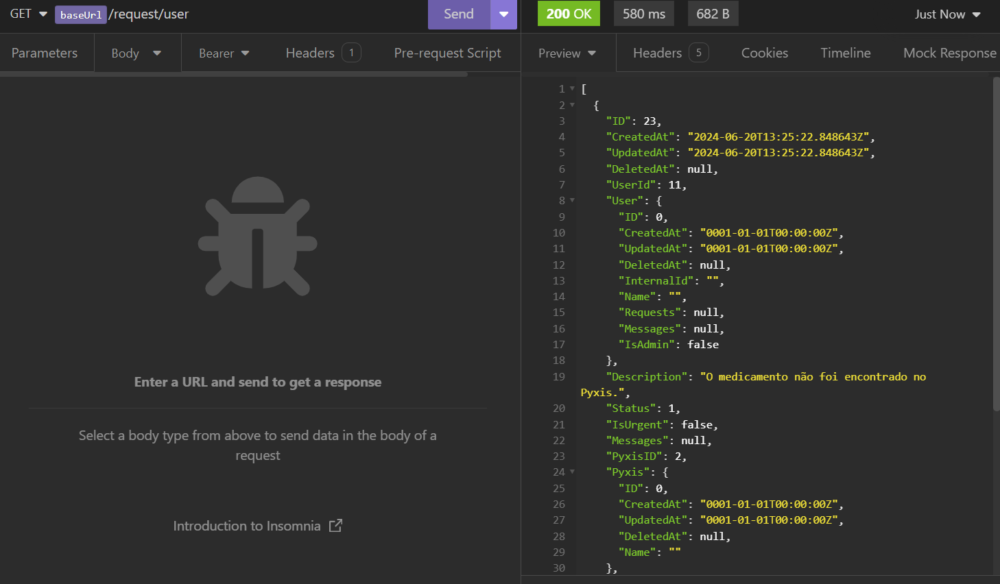
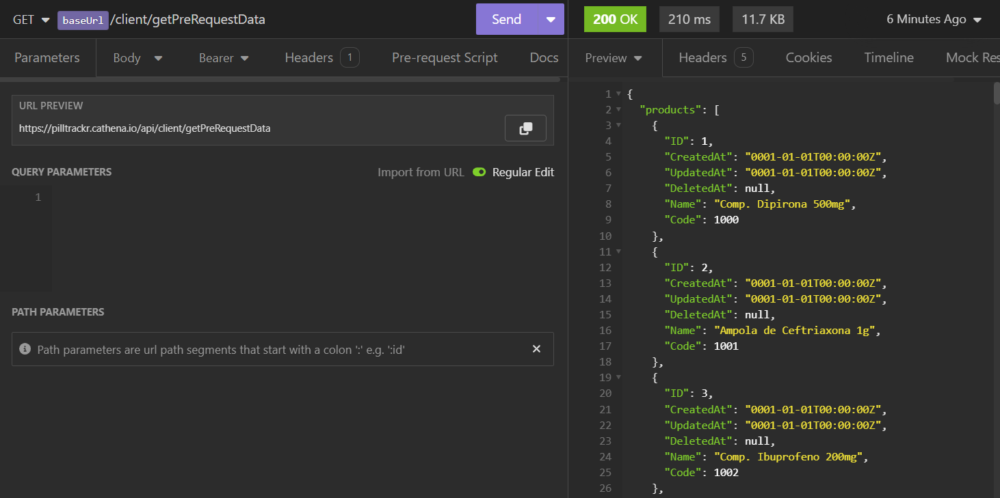
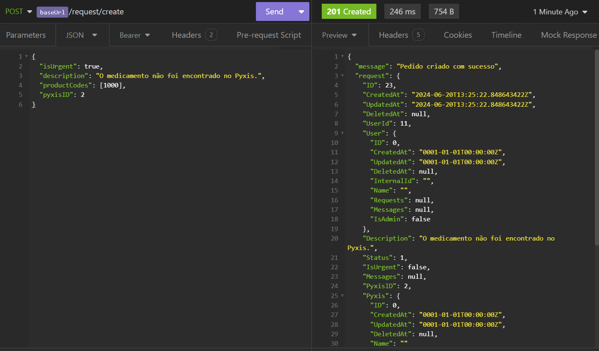

Durante a quarta sprint do projeto, o grupo se dedicou a realizar a integração entre as telas da aplicação Mobile, desenvolvida em Flutter, e o back-end da aplicação. Feita a integração, seria possível processar as requisições realizadas pelo usuário, de modo que os usuários da farmácia central fossem capaz de receber as solicitações dos enfermeiros, os quais também deveriam receber feedback acerca de seus pedidos feitos por meio do aplicativo.

**Telas integradas**

As telas foram integradas de modo que fosse permitido interagir através das rotas criadas no back-end da aplicação. O URL base da aplicação, https://pilltrackr.cathena.io/api, permite que diferentes endpoints sejam acessados.

**Tela de Histórico de Solicitações**

- <code>views/nursery/my_requests.dart</code>

A tela de requisições enviadas pelo usuário foi integrada. Atualmente, ela bate no endpoint <code>/request/user</code>. Isto é, uma vez que o enfermeiro faz a solicitação de um medicamento ou reporta um indidente relacionado ao Pyxis, sua solicitação é processada no back-end, armazenada no banco de dados, e fica disponível na página correspondente ao histórico de solicitações do usuário.

```bash
  Future<void> _fetchRequests() async {
    try {
      var response = await dio.get('/request/user');
      setState(() {
        _requests = List<Map<String, dynamic>>.from(response.data);
      });
    } catch (e) {
      print('Erro ao buscar requisições: $e');
    }
  }
```

Abaixo, é possível visualizar o retorno à requisição GET responsável pela exibição das informações de pedidos já existentes. São retornadas as informações preenchidas pelo usuário no formulário de requisição, bem como informações específicas relacionadas ao medicamento solicitado.



Exemplo de retorno:

```bash
[
	{
		"ID": 23,
		"CreatedAt": "2024-06-20T13:25:22.848643Z",
		"UpdatedAt": "2024-06-20T13:25:22.848643Z",
		"DeletedAt": null,
		"UserId": 11,
		"User": {
			"ID": 0,
			"CreatedAt": "0001-01-01T00:00:00Z",
			"UpdatedAt": "0001-01-01T00:00:00Z",
			"DeletedAt": null,
			"InternalId": "",
			"Name": "",
			"Requests": null,
			"Messages": null,
			"IsAdmin": false
		},
		"Description": "O medicamento não foi encontrado no Pyxis.",
		"Status": 1,
		"IsUrgent": false,
		"Messages": null,
		"PyxisID": 2,
		"Pyxis": {
			"ID": 0,
			"CreatedAt": "0001-01-01T00:00:00Z",
			"UpdatedAt": "0001-01-01T00:00:00Z",
			"DeletedAt": null,
			"Name": ""
		},
		"Products": [
			{
				"ID": 1,
				"CreatedAt": "0001-01-01T00:00:00Z",
				"UpdatedAt": "0001-01-01T00:00:00Z",
				"DeletedAt": null,
				"Name": "Comp. Dipirona 500mg",
				"Code": 1000
			}
		]
	}
]
```

**Tela de Solicitação de Medicamentos**

- <code>views/nursery/medicine_request.dart</code>

A tela que permite ao usuário a solicitação de um medicamento é considerada uma das mais importantes da aplicação, uma vez que permite a comunicação entre o enfermeiro e a farmácia central de forma ágil. Essa tela também foi integrada ao back-end da solução, de modo que seja levada para a visualização dos usuários que recebem as requisições. O endpoint correspondente à seleção dos medicamentos desejados é <code>/client/getPreRequestData</code>, uma vez que são exibidos na tela todos os medicamentos registrados.

```bash
  Future<void> _fetchMedicines() async {
    try {
      var response = await dio.get('/client/getPreRequestData');
      setState(() {
        List<dynamic> products = response.data['products'];
        _medicines = products.map((product) => product['Name'] as String).toList();
        for (var product in products) {
          _medicineCodes[product['Name']] = product['Code'] as int;
        }
      });
    } catch (e) {
      print('Erro ao buscar medicamentos: $e');
    }
  }
```

Na imagem abaixo, é possível visualizar o retorno à requisição GET realizada. São retornados os atributos "Id", "CreatedAt", "UpdatedAt", "DeletedAt", "Name" e "Code".



Exemplo de retorno:

```bash
{
	"products": [
		{
			"ID": 1,
			"CreatedAt": "0001-01-01T00:00:00Z",
			"UpdatedAt": "0001-01-01T00:00:00Z",
			"DeletedAt": null,
			"Name": "Comp. Dipirona 500mg",
			"Code": 1000
		},
		{
			"ID": 2,
			"CreatedAt": "0001-01-01T00:00:00Z",
			"UpdatedAt": "0001-01-01T00:00:00Z",
			"DeletedAt": null,
			"Name": "Ampola de Ceftriaxona 1g",
			"Code": 1001
		},
		{
			"ID": 3,
			"CreatedAt": "0001-01-01T00:00:00Z",
			"UpdatedAt": "0001-01-01T00:00:00Z",
			"DeletedAt": null,
			"Name": "Comp. Ibuprofeno 200mg",
			"Code": 1002
		},
		{
			"ID": 4,
			"CreatedAt": "0001-01-01T00:00:00Z",
			"UpdatedAt": "0001-01-01T00:00:00Z",
			"DeletedAt": null,
			"Name": "Comp. Paracetamol 750mg",
			"Code": 1003
		},
		{
			"ID": 5,
			"CreatedAt": "0001-01-01T00:00:00Z",
			"UpdatedAt": "0001-01-01T00:00:00Z",
			"DeletedAt": null,
			"Name": "Comp. Aspirina 100mg",
			"Code": 1004
		},
		{
			"ID": 6,
			"CreatedAt": "0001-01-01T00:00:00Z",
			"UpdatedAt": "0001-01-01T00:00:00Z",
			"DeletedAt": null,
			"Name": "Comp. Amoxicilina 500mg",
			"Code": 1005
		},
		{
			"ID": 7,
			"CreatedAt": "0001-01-01T00:00:00Z",
			"UpdatedAt": "0001-01-01T00:00:00Z",
			"DeletedAt": null,
			"Name": "Comp. Clonazepam 2mg",
			"Code": 1006
		},
		{
			"ID": 8,
			"CreatedAt": "0001-01-01T00:00:00Z",
			"UpdatedAt": "0001-01-01T00:00:00Z",
			"DeletedAt": null,
			"Name": "Comp. Enalapril 10mg",
			"Code": 1007
		},
		{
			"ID": 9,
			"CreatedAt": "0001-01-01T00:00:00Z",
			"UpdatedAt": "0001-01-01T00:00:00Z",
			"DeletedAt": null,
			"Name": "Seringa Insulina 1ml",
			"Code": 1008
		},
		{
			"ID": 10,
			"CreatedAt": "0001-01-01T00:00:00Z",
			"UpdatedAt": "0001-01-01T00:00:00Z",
			"DeletedAt": null,
			"Name": "Soro Fisiológico 500ml",
			"Code": 1009
		}
	]
}
```

Além disso, a integração conta com o endpoint responsável pela criação da solicitação no banco de dados: <code>/request/create</code>, o qual registra todos os atributos indicados pelo usuário na tela.

```bash
Future<void> _sendRequest() async {
    String requestId = 'PR-0081P';
    String pyxisLocation = 'MS1347 - 14º Andar';
    print(_selectedPyxies);

    if (_selectedMedicine == null || _productCode == null) {
      print('Medicamento ou código do produto não selecionado.');
      return;
    }

    try {
      var response = await dio.post('/request/create', data: {
        "isUrgent":  _isImmediate,
        "description": _descriptionController.text,
        "productCodes":  [_productCode],
        "pyxisID": 2
      });

      if (response.statusCode == 201) {
        print('Requisição enviada com sucesso.');
        Navigator.pushNamed(
          context,
          '/feedbackRequest',
          arguments: {'requestId': requestId, 'pyxisLocation': pyxisLocation},
        );
      } else {
        print('Erro ao enviar requisição: ${response.statusMessage}');
      }
    } catch (e) {
      print('Erro ao enviar requisição: $e');
    }
  }
```

Na imagem abaixo, é possível visualizar a resposta à requsição POST realizada. O retorno apresenta um feedback ao usuário no que concerne ao sucesso de sua solicitação, os atributos indicados por ele ao preencher o formulário de solicitação e, por fim, as informações do medicamento associado à requisição.



Exemplo de retorno:

```bash
{
	"message": "Pedido criado com sucesso",
	"request": {
		"ID": 23,
		"CreatedAt": "2024-06-20T13:25:22.848643422Z",
		"UpdatedAt": "2024-06-20T13:25:22.848643422Z",
		"DeletedAt": null,
		"UserId": 11,
		"User": {
			"ID": 0,
			"CreatedAt": "0001-01-01T00:00:00Z",
			"UpdatedAt": "0001-01-01T00:00:00Z",
			"DeletedAt": null,
			"InternalId": "",
			"Name": "",
			"Requests": null,
			"Messages": null,
			"IsAdmin": false
		},
		"Description": "O medicamento não foi encontrado no Pyxis.",
		"Status": 1,
		"IsUrgent": false,
		"Messages": null,
		"PyxisID": 2,
		"Pyxis": {
			"ID": 0,
			"CreatedAt": "0001-01-01T00:00:00Z",
			"UpdatedAt": "0001-01-01T00:00:00Z",
			"DeletedAt": null,
			"Name": ""
		},
		"Products": [
			{
				"ID": 1,
				"CreatedAt": "2024-06-20T13:25:22.85045166Z",
				"UpdatedAt": "2024-06-20T13:25:22.85045166Z",
				"DeletedAt": null,
				"Name": "Comp. Dipirona 500mg",
				"Code": 1000
			}
		]
	}
}
```